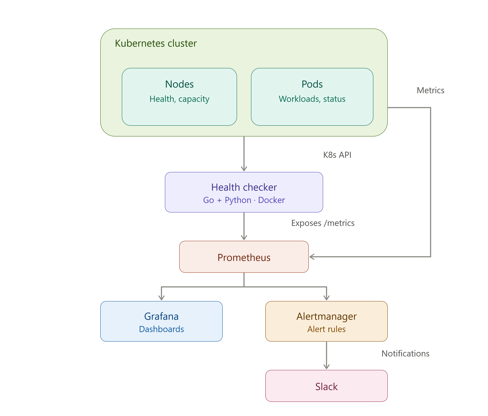

# Capstone-Project---Kubernetes-Cluster-Health-Monitoring-System
Capstone Project by Hero Vired  - Authors : rajkumaramithn &amp; hitesh-1984-pardeshi

# Kubernetes Cluster Health Checker and Auto-Healing

An automated health monitoring and self-healing tool for Kubernetes clusters. It detects common issues — failed pods, unresponsive nodes, resource pressure — and takes corrective action automatically, reducing the manual overhead for small DevOps teams managing large-scale clusters.

## Problem statement

Manually monitoring and troubleshooting Kubernetes clusters is time-consuming and error-prone, especially for small teams managing large deployments. This project automates detection and recovery of common failure modes to improve availability and reduce operator burden.

## Goals

1. Automated health monitoring of node health, pod status, and resource utilization.
2. Self-healing actions: pod restarts, rescheduling, and scaling to balance workloads.
3. Real-time alerts and notifications for issues requiring manual intervention.
4. A web dashboard showing live health status, historical data, and auto-healing logs.

## Tech stack

| Layer | Tool | Purpose |
|---|---|---|
| Core service | Go | Kubernetes API interaction, performance-critical logic |
| Scripting | Python | Data processing, glue scripts |
| Cluster control | Kubernetes API (client-go) | Read/write access to nodes, pods, deployments |
| Metrics | Prometheus | Cluster and application metric collection |
| Visualization | Grafana | Real-time and historical dashboards |
| Alerting | Alertmanager | Threshold-based alert routing |
| Notifications | Slack API | Delivering alerts to the DevOps team |
| Packaging | Docker | Containerizing the service for deployment |

## Architecture

## Kubernetes Cluster (Nodes & Pods)

The environment being monitored by the system. Nodes represent the machines running the cluster and report health conditions such as readiness and resource pressure, while Pods represent the workloads scheduled on them and report status such as running, pending, or failed. This layer is the foundation the entire architecture is built around.

## Health Checker (Go + Python, Docker)

The core application of the project, responsible for watching cluster state and triggering self-healing actions when issues are detected. Go handles direct interaction with the Kubernetes API for performance, while Python supports auxiliary scripting, and Docker packages it for deployment. It connects directly to the cluster via the Kubernetes API and is the only component that actively modifies cluster state.

## Prometheus

The metrics collection layer that scrapes health and resource data from the cluster and the Health Checker at regular intervals, storing it as time-series data. It sits at the center of the observability stack, feeding data to both the visualization and alerting components.

## Grafana

The visualization layer that queries Prometheus to render real-time and historical dashboards of cluster health and auto-healing activity. It connects only to Prometheus and provides the primary interface for reviewing system status.

## Alertmanager

The alert routing layer that evaluates rules against Prometheus data and manages deduplication, grouping, and routing of alerts. It receives triggered alerts from Prometheus and forwards them to the appropriate notification channel based on severity.

## Slack

The notification endpoint that delivers alerts routed through Alertmanager. It connects to the end of the pipeline, surfacing critical issues that may require manual attention.

## Project Execution

## Sprint 1 - Project Setup and Kubernetes Cluster Access

Project File Structure Definition 

## Step 1 - Initializing the Go Project

<b>On the Command Line Terminal Run :</b>

go mod init Capstone-Project---Kubernetes-Cluster-Health-Monitoring-System
go get k8s.io/client-go@latest
go get k8s.io/apimachinery@latest
go get k8s.io/api@latest
go get github.com/gin-gonic/gin

<b>File Structure Responsibilities</b>

📁 cmd/healer/main.go
<i>Entry point (starts everything)</i>

📁 internal/k8sclient
<i>Talks to Kubernetes (list pods, get status)</i>

📁 internal/monitor
<i>Checks health rules (CrashLoopBackOff detection)</i>

📁 internal/alerts
<i>Prints/logs alerts</i>

📁 internal/healer
<i>auto-fix logic</i>

## Step 2 - Creating and Setting up the Go Files 

<b>Create MAIN ENTRY (cmd/healer/main.go)</b>

Refer to: cmd\healer\main.go

Starts a Kubernetes health monitoring loop that continuously fetches pods from the “default” namespace and checks their status every 10 seconds.
It connects to the cluster using k8sclient, then passes pod data to monitor.CheckPods() for health evaluation and detection of issues.

<b>Kubernetes Client (internal/k8sclient)</b>

Refer to: internal\k8sclient\client.go

Creates a Kubernetes client in Go that connects either to a local kubeconfig (Minikube) or in-cluster config, then fetches all pods from a given namespace.
GetPods() uses the Kubernetes API to list pods and returns them so your monitor can check their health status.

<b>Monitor Logic</b>

Refer to: internal\monitor\monitor.go

This code:

Loops through all Kubernetes pods and checks each container’s status to detect unhealthy conditions like high restart count or waiting state.
If a problem is found, it prints an alert indicating that the pod is unhealthy (basic health monitoring logic).

<b>Alerts Module (simple for Sprint 1)</b>

Refer to: internal\alerts\alerts.go

Creates an alerts package with a function that prints an alert message to the console.
SendAlert() is used to simulate sending notifications when a problem is detected in the Kubernetes cluster.

## Step 3 - Creating the RBAC YAML file for Kubernetes Access

Refer to: deploy\manifests\rbac.yaml

It creates a ServiceAccount + RBAC rules so your app can list and watch pods in the cluster.

---
apiVersion: rbac.authorization.k8s.io/v1
kind: ClusterRole
metadata:
  name: health-monitor-role
rules:
- apiGroups: [""]
  resources: ["pods"]
  verbs: ["get", "list", "watch"]
---
apiVersion: rbac.authorization.k8s.io/v1
kind: ClusterRoleBinding
metadata:
  name: health-monitor-binding
roleRef:
  apiGroup: rbac.authorization.k8s.io
  kind: ClusterRole
  name: health-monitor-role
subjects:
- kind: ServiceAccount
  name: health-monitor-sa
  namespace: default

<b></b>
<b></b>
<b></b>
<b></b>
